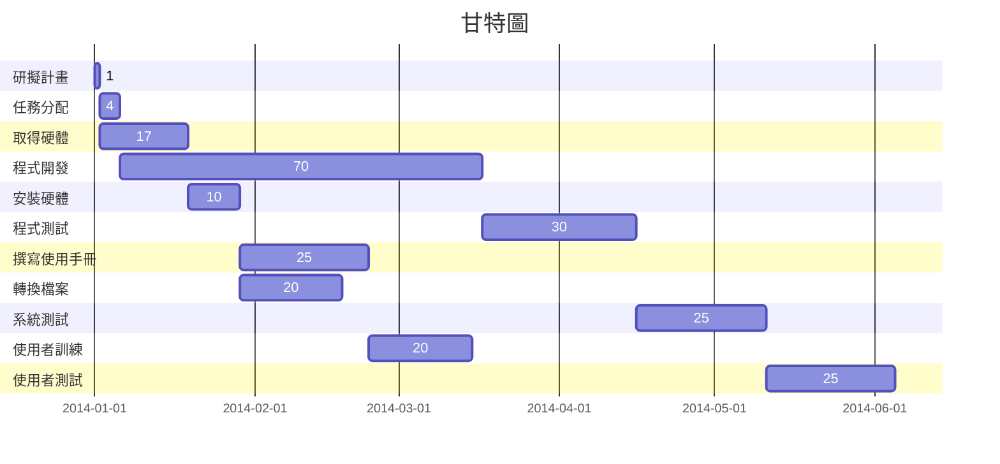

)](https://user-images.githubusercontent.com/79584249/195106994-76619a09-ae12-4c1a-86bd-561263ee5dc0.jpg)

---

```mermaid
gantt
    title 甘特圖
    
    section 研擬計畫
    1       :a1, 2014-01-01, 1d
   
    section 任務分配
    4       :a2, after a1  , 4d
    
    section 取得硬體
    17      :a3, after a1 , 17d
    
    section 程式開發
    70      :a4, after a2  , 70d
    
    section 安裝硬體
    10      :a5, after a3  , 10d
    
    section 程式測試
    30      :a6, after a4  , 30d
    
    section 撰寫使用手冊
    25      :a7, after a5  , 25d
    
    section 轉換檔案
    20      :a8, after a5  , 20d
    
    section 系統測試
    25      :a9, after a6  , 25d
    
    section 使用者訓練
    20      :a10, after a7  , 20d
    
    section 使用者測試
    25      :a11, after a9  , 25d
```
